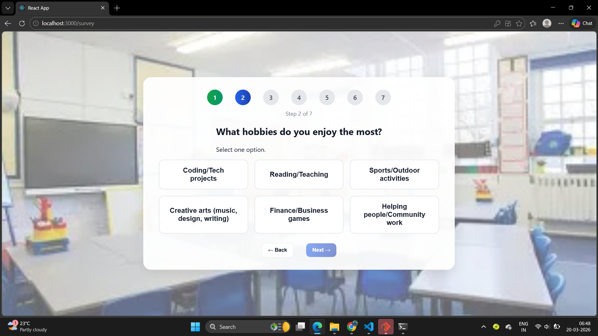
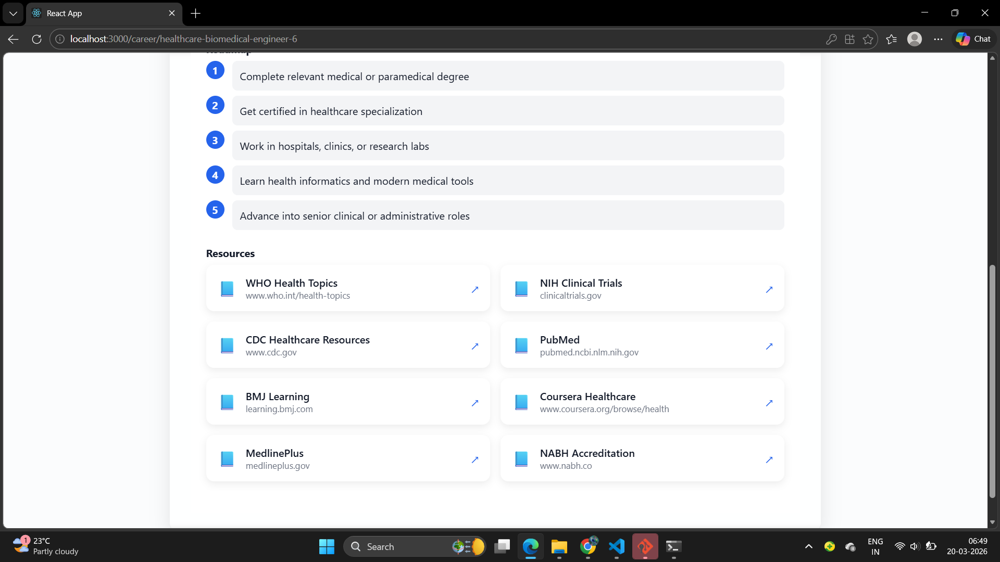
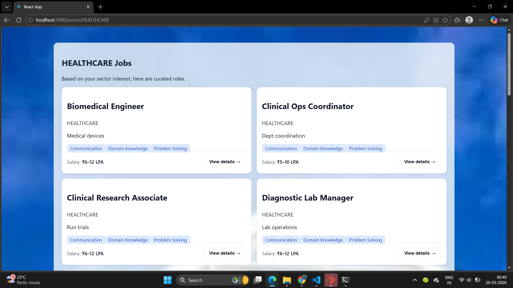

# Career Path Finder

## 📌 Description
A smart career guidance platform that helps students identify high-paying, future-proof roles (₹8–15 LPA) based on their skills and interests.

## 🚀 Features
- Personalized career recommendations
- Skill gap analysis
- Learning roadmap guidance
- Focus on non-coding & data-driven careers

## 🖼️ Project Workflow

## 🛠️ Technologies Used
- HTML, CSS, JavaScript (or whatever you used)

## 🎯 Goal
To help students make informed career decisions and bridge the gap between skills and industry demands.
