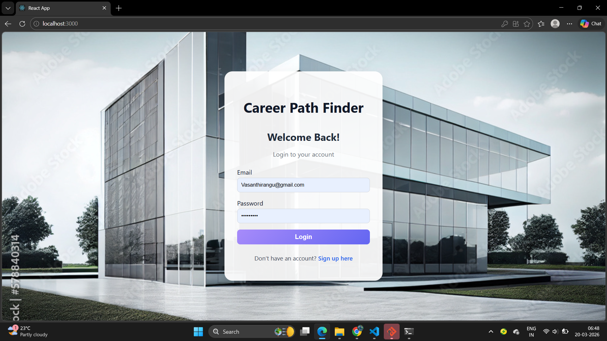
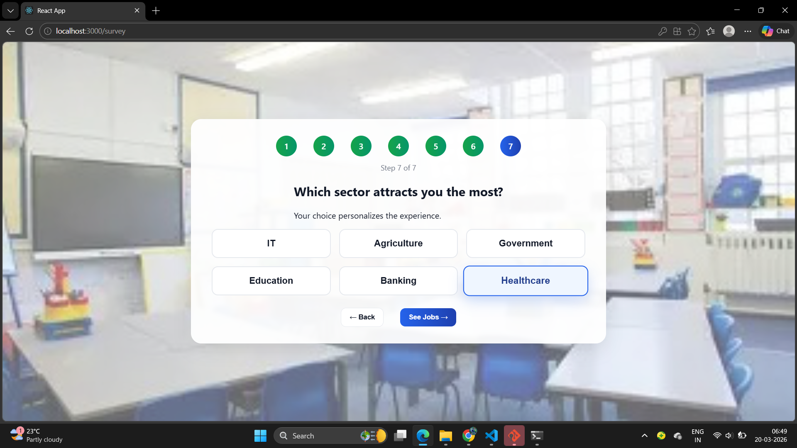
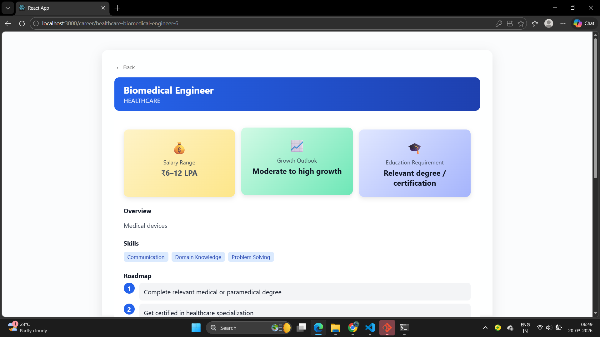

#  Career Path Finder

##  Overview
Career Path Finder is a smart guidance platform designed to help students identify high-paying, future-proof career options (₹8–15 LPA) based on their skills, interests, and goals. It focuses on non-coding and data-driven career paths.

---

##  Problem Statement
Many students are confused about choosing the right career path due to lack of guidance, awareness, and structured planning. This project aims to bridge that gap.

---

##  Solution
This platform analyzes user inputs such as interests, skills, and preferences to provide:
- Personalized career recommendations  
- Skill gap analysis  
- Clear learning roadmap  

---

##  Features
-  Career recommendations based on user profile  
-  Skill-based analysis  
-  Step-by-step career roadmap  
-  Focus on high-paying, future-proof roles  
-  Special focus on non-coding career paths  

---

##  Project Workflow

###  Sign Up

###  Survey

###  Survey Questions

###  Recommendations

###  Job Details

###  Career Journey

---

## 🛠️ Technologies Used
- HTML  
- CSS  
- JavaScript  
- React
- Firebase (As a Database Storage)
---

## Project Demo
  👉 https://youtu.be/bNJczNR6F5Y

##  Future Enhancements
- AI-based career prediction  
- Resume analysis integration  
- Job market insights  
- Real-time skill tracking  

---

##  Author
**Vasanthi Rangu**

---

##  Conclusion
This project helps students make informed career decisions and provides a structured path to achieve their goals in today’s competitive job market.
